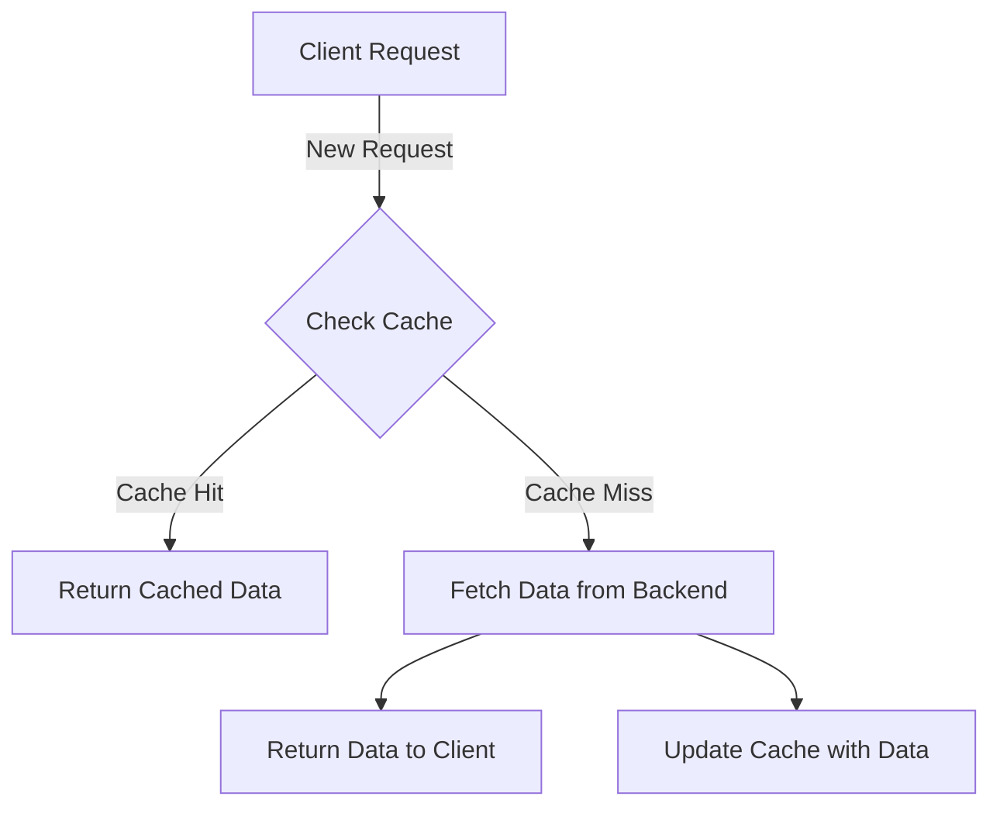


  This feature has not been yet implemented.


Parapluie can cache results to avoid calling the backend infrastructure on every request. 

When a client requests data, Parapluie first checks its cache. If the data is present and still valid (i.e., not expired), it returns the cached data immediately. 

This speeds up response times and prevents the backend from being overwhelmed by repeated identical queries, thus optimizing resource utilization and improving overall system performance.

