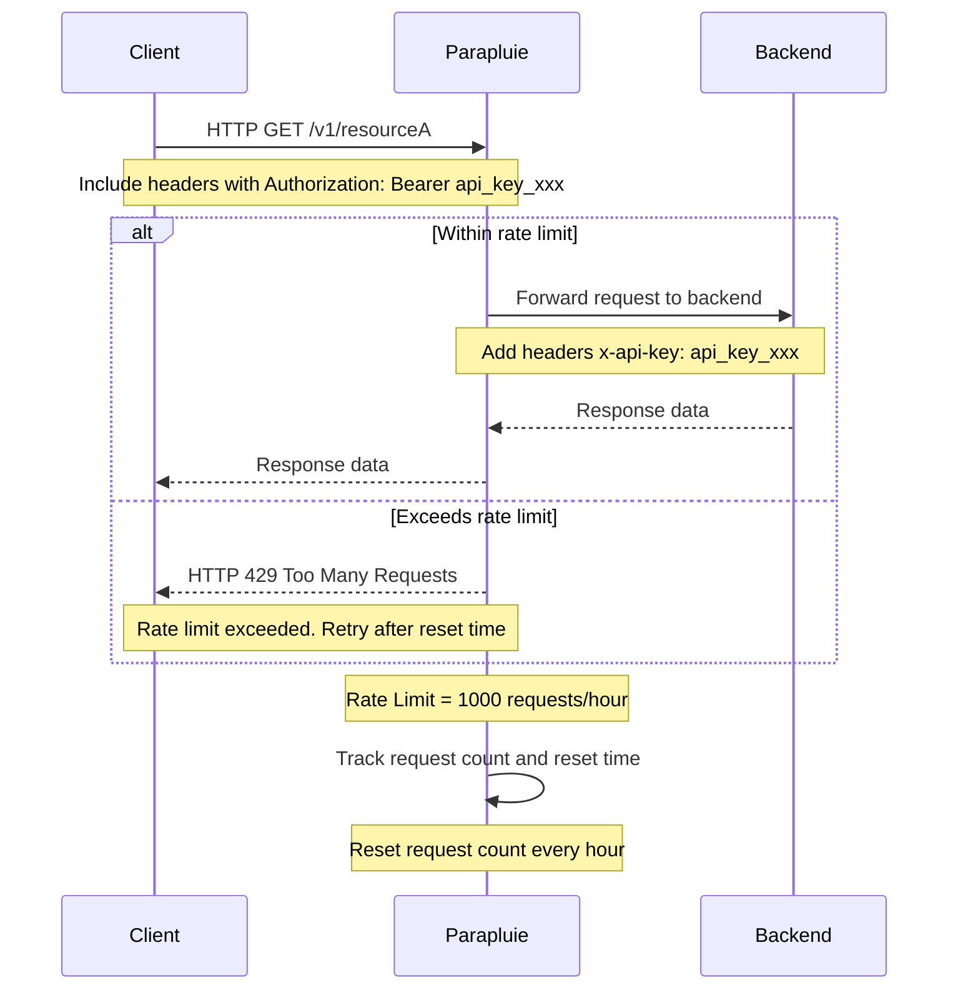

Parapluie provides a robust rate limiting feature to help you control the number of API requests made within a specified time frame. This helps protect your backend infrastructure from being overwhelmed by too many requests and ensures fair usage among all users.

## How Rate Limits Work
Rate limits define the maximum number of requests that can be made to an API within a specific time period. When the rate limit is reached, additional requests are denied until the rate limit window resets. This mechanism helps to:

- Prevent abuse and overuse of your API.
- Ensure consistent performance and availability of your services.
- Manage traffic and load on your backend infrastructure.


## Components of Rate Limits
- Limit: The maximum number of requests allowed within the rate limit window.
- Window: The time period during which the limit applies, such as per minute, hour, or day.
- Reset Time: The time at which the rate limit window resets and the request count is cleared.





## Rate Limits Management

**Prerequisite :**

Before performing any of the following action you must have :
- A parapluie [root token](/parapluie/authentication)
- A [Consumer API Key](/parapluie/features/consumer-api-key)



For sake of documentation's clarity, parapluie's root token has been exported as an environement variable :
 `export PARAPLUIE_ROOT_TOKEN=<root_token_xxx>`


### Create a Rate Limit


  
  ```bash
  curl -X POST https://parapluie.io/rate-limit/create \ 
    --header '{"Authorization": "Bearer $PARAPLUIE_ROOT_TOKEN"}' \
    --data '{       
        "rateLimitId": "basic",
        "description":"Rate limit plan for basic consumers",
        "limit": 1000,
        "period": "hour"
        }'
  ```

Command's output :

  ```json
{
  "rateLimitId": "basic",
  "description":"Rate limit plan for basic consumers.",
  "limit": 1000,
  "period": "hour",
  "createdAt": "2024-07-31T12:00:00Z"
}
  ```

- **id** is a custom string that will identified the rate limit plan. This will be used to match a plan to a [Consumer API Key](/parapluie/features/consumer-api-key) further on.
- **description** can be anything you would like to help you describe what's the rate limit plan about.
- **limit** is the number of request to allow within a specified time period.
- **period** is the time window for the rate limit to apply. 

In our example a maximum of 1000 requests per hour can be made.
    



### Applying Rate Limits to Consumer API Key

When you have created a rate limit plan, you can then bind it to a [Consumer API Key](/parapluie/features/consumer-api-key).


  

  ```bash
  curl -X POST https://parapluie.io/api-keys/apply-rate-limit \
--header '{"Authorization": "Bearer $PARAPLUIE_ROOT_TOKEN"}' \
--data '{
    "consumerApiKeyId": "xxx",
    "rateLimitId": "basic"
    }'
```
    




## Handling Rate Limit Exceeded

When a user exceeds the defined rate limit, Parapluie responds with a `429 : Too Many Requests` status code. The response includes information about when the rate limit will reset. Here’s how you can simulate this scenario with cURL:

```bash
curl -X GET https://parapluie.io/resourceA \
-H "Authorization: Bearer api_key_abc123"
```

If the rate limit is exceeded, you would receive a response similar to this:

```json
{
  "error": "Rate limit exceeded",
  "limit": 1000,
  "period": "hour",
  "remaining": 0,
  "resetTime": "2024-07-31T13:00:00Z"
}
```


