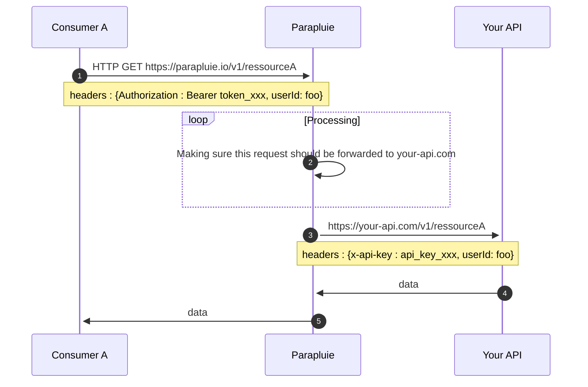

## Parapluie is a proxy


<!--  -->



## 1. Consumer send a request to Parapluie

**Consumer A** sends a request to `https://parapluie.io/v1/ressourceA` with some headers : 

```json
{
  "Authorization" : "Bearer token_xxx", 
  "userId": "foo"
  }
```
`Authorization` value is an [Consumer API key](/parapluie/features/consumer-api-key) used by Parapluie when processing the query.

Excepted `Authorization`, all headers will be forwarded AS-IS to your API (in our example `userId` header).

## 2. Parapluie process the request

**Parapluie** starts by processing the `Authorization` token :

- Identifying the user - *who do you claim to be ?*
- Authenticating the user - *prove you're the one you claim to be ?*
- Authorizing the user - *what rules apply to you ?*

Once user has been authenticated, *Parapluie* checks what rules applies to this consumer :
- Is the requested data cached ?
- Is this consumer rate limited ? 
- Does the rate limit apply to this query ?

Once rules have been processed, data can either be sent back directly to **Consumer A** if cached, or the request can be forwarded to **your-api.com**. 

In this example we will suppose no cache exist.

## 3. Parapluie forward request to your-api.com

When Parapluie forwards a query to your backend API, it will request the same route that was asked by **Consumer A**, here `/v1/ressourceA`. 

Headers will also be forwarded, with the exception of `Authorization` : the value of this header is replaced with a secret key that only parapluie and your API know. This is to prevent **Consumer A** to directly query your API resources ([read here why](/parapluie/motivation)) 

## 4. your-api.com send the data back to parapluie

Finally your API get into action ! This is the part your code do something, like fetching some data from a database for example. This data is then sent back to Parapluie.

## 5. Parapluie send the data back to Consumer A

The fetched data is then forwarded to **Consumer A**.